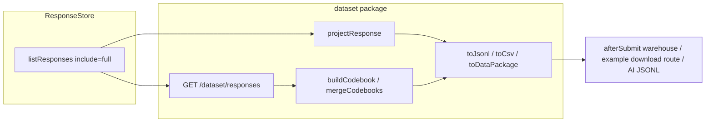

# `@dimah-form/dataset` reporting layer

A read-side plugin in the scoring shape: derived data, no tables, no `meta` namespace. Canonical interchange is **JSON Lines + codebook**, not a one-shot CSV download. HTTP stays paged (`LIST_MAX_LIMIT` 100). Full-file zip lives in the consumer app.



## Spec v1 (freeze)

`spec: "dimah.dataset/v1"` on every object.

**`DatasetRecord`** — one response, no raw `definition`:

- identity: `id`, `formId`, `status`, `submittedAt`, `createdAt`, `snapshotKey`
- optional `respondentId` (HTTP default on; package encode default off)
- `fields: [{ id, type, value, formatted }]` — `value` is stored JSON; `formatted` is [`formatAnswer`](packages/core/src/field-view.ts)
- optional `scores` from `scoreResponse` when that snapshot has `meta.scoring`

**`Codebook`** — built from **snapshots in the dataset**, never silently from the live form:

- `snapshots: [{ key, n, firstSeenAt?, lastSeenAt? }]`
- `fields: [{ id, type, label, options?, inSnapshots, labelConflicts? }]`
- optional `scores` variable/band docs
- if a field label/options drift across snapshots, record `labelConflicts` — do not merge into the live label

**`DataPackage`** — Frictionless-style file map (not a zip in the library):

- `datapackage.json` (resources + Table Schema)
- `codebook.json`
- `responses.jsonl` (canonical)
- `responses.csv` (RFC 4180 **codes**; multiSelect joined with `;`)
- `responses.labels.csv` (Excel convenience; UTF-8 BOM allowed only here)

CSV column order: identity, then field ids from codebook order (else sorted ids), then `score.<id>.raw` / `.band` / `.complete`. Stable across newest-first pagination — not first-seen, not live form order unless the caller passes that codebook.

`snapshotKey`: SHA-256 hex of canonical JSON (sorted keys) of the response definition. `crypto.subtle.digest` (Node 20 + browser). `snapshotKey` / `projectResponse` are async.

Out of v1: SPSS/Parquet/FHIR encoders, attachment facet, `meta.dataset`, census analytics, LLM calls, raising `LIST_MAX_LIMIT`, zip inside `dimahForm()`.

## Package layout

Clone [packages/scoring](packages/scoring) (`package.json` exports `.` + `./client`, tsup dual entry, optional `@dimah-form/server` peer, workspace version with the line).

```
packages/dataset/src/
  spec.ts          # DATASET_SPEC, Zod for record/codebook/page
  hash.ts          # canonicalJson, snapshotKey
  project.ts       # projectResponse
  codebook.ts      # buildCodebook, mergeCodebooks, liveCodebook
  encode.ts        # toJsonl, toCsv, toCsvLabels, toDataPackage
  reader.ts        # createDatasetReader — pages + mergeCodebooks
  plugin.ts        # datasetPlugin()
  client.ts        # datasetClientPlugin + isomorphic re-exports
  routes.ts        # /dataset/responses, /dataset/codebook
  errors.ts
  index.ts         # server factory + isomorphic (do not import plugin from client)
```

Peers: `@dimah-form/core` required; `@dimah-form/server` optional; `@dimah-form/scoring` optional. Static-import `scoreResponse` / `hasScoringMeta` in the scoring contributor; skip `scores` when meta is absent. Plugin `getDatasetPage` always runs that contributor.

No `metaNamespace`, no `$Meta`, no `validateDefinition`, no tables. Plugin `id`: `"dataset"`.

## HTTP (thin)

Reuse pagination helpers from [`packages/core/src/schema/protocol.ts`](packages/core/src/schema/protocol.ts) (`normalizeListPage`, `pageFromOverfetch`, same 50/100 limits). **Always pass `limit + 1` into the store** like [`list-responses.ts`](packages/server/src/api/routes/list-responses.ts). Never call `listResponses` without a limit.

- `GET /dataset/responses` (`getDatasetPage`) — **`formId` required**. Default `status=submitted`. Query: `limit` / `offset`. Load `include: "full"`, project, return:

```ts
{
  (spec, records, codebook /* this page only */, limit, offset, nextOffset);
}
```

- `GET /dataset/codebook` (`getLiveCodebook`) — codebook of the **live** form. Docs must say it is not historical.

Guard operations = endpoint keys. Throw `errors.unknownForm` / existing server errors. Filename/zip/timeout stay out of the plugin.

`createDatasetReader({ page })` walks `nextOffset`, yields records, and `mergeCodebooks` into one historical codebook. Same helper for server jobs and the example download route.

## Example app

- Register `datasetPlugin()` next to scoring in [`examples/next/lib/form.ts`](examples/next/lib/form.ts) and `datasetClientPlugin()` in [`examples/next/lib/client.ts`](examples/next/lib/client.ts).
- Add a **consumer** route (e.g. `examples/next/app/api/forms/[formId]/package/route.ts`) that uses the reader + `toDataPackage` / `toJsonl` and returns a file (`text/csv` or `application/x-ndjson`). No new zip dependency.
- On [`examples/next/app/responses/page.tsx`](examples/next/app/responses/page.tsx): download link + optional table of projected records. Guard already treats `listResponses` as admin; document `getDatasetPage` / `getLiveCodebook` the same way in auth docs.

`afterSubmit` warehouse pattern is documented only (same idea as scoring `onScore`).

## Docs and repo wiring

New docs page `apps/docs/content/docs/(extend)/dataset.mdx`; add to [`(extend)/meta.json`](<apps/docs/content/docs/(extend)/meta.json>) and plugin cards. Update:

- [docs/agents/architecture.md](docs/agents/architecture.md) and [docs/agents/packages.md](docs/agents/packages.md) (new package; plugins must not add tables; dataset is compute-on-read)
- [apps/docs/content/docs/(concepts)/architecture.mdx](<apps/docs/content/docs/(concepts)/architecture.mdx>), root [README.md](README.md), [apps/docs/src/lib/llm-intro.ts](apps/docs/src/lib/llm-intro.ts), [apps/docs/src/lib/shared.ts](apps/docs/src/lib/shared.ts) `npmPackageUrls`
- [.github/labeler.yml](.github/labeler.yml) `pkg:dataset`
- `.tegami/YYYY-MM-DD-dataset.md` — `group:dimah-form: minor` (new published package; mention npm Trusted Publisher / `pretrust` from [release.md](docs/agents/release.md))

## Tests

Mirror scoring: `project.test.ts`, `codebook.test.ts` (labelConflicts + mixed snapshots), `encode.test.ts` (RFC4180 quotes/newlines), `hash.test.ts` (stable key), `plugin.test.ts` (`dimahForm` + `memoryAdapter`, pagination `nextOffset`, default submitted, live vs snapshot codebook, scores attached without writing `answers`).

Do not flatten against the live questionnaire when the stored snapshot differs.
