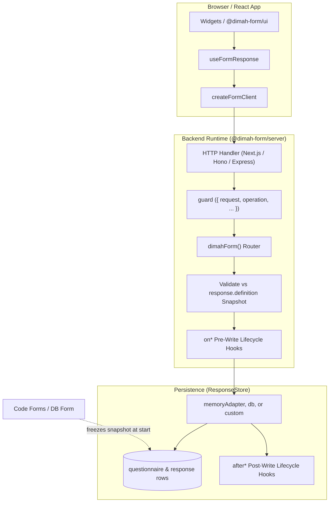

The library owns the protocol, definition snapshots, and submit validation. Your app owns widgets, auth, and the database adapter. Those four boundaries are the architecture.

---

## Principles

<Cards>
  <Card
    title="Headless by Design"
    description="react ships no widgets. Bind fields yourself, or opt into optional @dimah-form/ui."
  />
  <Card
    title="Snapshot Invariant"
    description="A fill freezes the definition at start. Editing the live form does not break in-flight drafts."
  />
  <Card
    title="Protocol Single Source of Truth"
    description="@dimah-form/core defines all routes, payloads, and validators. Server and client never drift."
  />
  <Card
    title="Zero-ORM Server Engine"
    description="@dimah-form/server has no database dependencies. Storage is abstracted through the ResponseStore interface."
  />
</Cards>

---

## System Flow

The diagram shows how widgets, HTTP routes, `guard`, validation, and the store fit together:

<ArchitectureDiagram />

<Accordions>
<Accordion title="View Mermaid Diagram">

</Accordion>
</Accordions>

---

## Package Boundaries

Each package has one job and a one-way dependency graph:

| Package                   | Environment         | Responsibility                                                                                                                                                                                   | Key Exports                                                                  |
| :------------------------ | :------------------ | :----------------------------------------------------------------------------------------------------------------------------------------------------------------------------------------------- | :--------------------------------------------------------------------------- |
| **`@dimah-form/core`**    | Universal           | Protocol SSOT, Zod schemas, field definitions, answer validation, error codes, and type inference. Shared app helpers live on `@dimah-form/core/app-protocol` (re-exported by server and react). | `defineForm`, `defineFieldType`, `APIError`, `FORM_ERROR_CODES`              |
| **`@dimah-form/server`**  | Server              | Backend router, HTTP framework adapters, `form.api`, lifecycle hook dispatcher, and `memoryAdapter()`. Apps import protocol helpers from here, not from `core`.                                  | `dimahForm()`, `toNextJsHandler`, `toHonoHandler`, `memoryAdapter`, `errors` |
| **`@dimah-form/react`**   | Browser             | Headless React client, session state machine, visibility resolver, field bindings, and autosave. Apps import protocol helpers from here in client modules.                                       | `createFormClient()`, `useFormResponse()`, `fieldLabel`, `fieldOptions`      |
| **`@dimah-form/ui`**      | Browser             | Optional. shadcn renderer and registry source on top of `FormResponseApi` / `FormFieldBinding`.                                                                                                  | `FormView`, `FormScope`, `FormField`, `FormUiProvider`                       |
| **`@dimah-form/db`**      | Server              | Optional. Production SQL adapter using FumaDB for Drizzle, Prisma, and Kysely.                                                                                                                   | `DimahFormDB`, `db()`                                                        |
| **`@dimah-form/scoring`** | Server / isomorphic | Official scoring plugin. `meta.scoring` on the snapshot; Likert points or option `add` keying; compute-on-read totals and bands. Peer of `server`.                                               | `scoringPlugin()`, `scoreResponse()`, `scoringClientPlugin()`                |
| **`@dimah-form/dataset`** | Server / isomorphic | Official dataset plugin. Versioned JSONL + codebook from response snapshots; paged HTTP; CSV convenience. Compute-on-read; no tables. Peer of `server`.                                          | `datasetPlugin()`, `projectResponse()`, `createDatasetReader()`              |

---

## Request Pipeline

Every mutation and query runs the same six stages:

<Flow
  label="Execution Lifecycle"
  steps={[
    { name: "1. Parse", kind: "protocol", note: "Zod query / body check" },
    { name: "2. Guard", kind: "server", note: "Auth & permissions" },
    { name: "3. Validate", kind: "protocol", note: "Against snapshot" },
    { name: "4. on* Hook", kind: "server", note: "Pre-write mutation" },
    { name: "5. Persist", kind: "data", note: "Store write & CAS" },
    { name: "6. after* Hook", kind: "server", note: "Side-effects" },
  ]}
/>

### 1. Inbound Parse & Schema Validation

The HTTP adapter parses the incoming HTTP request and validates query parameters or body payloads against the Zod schemas defined in `@dimah-form/core`. Malformed requests immediately return `400 VALIDATION_ERROR`.

### 2. Security Guard

The optional `guard` hook executes before any database or form logic. You inspect the `request`, `operation`, `formId`, or `responseId`, verify user session cookies/tokens, and enforce permissions. Throwing an `APIError` halts execution and sends a structured error response.

### 3. Snapshot Validation

When saving drafts or submitting responses, answer values are validated **against the frozen `response.definition` snapshot**, never against the live form schema. Submitting verifies that all visible required fields are populated and valid. Hidden fields (per `showWhen`) are automatically stripped.

### 4. Pre-Write Hooks (`on*`)

Pre-persistence hooks (such as `onStart`, `onSaveDraft`, `onSubmit`) run before the database transaction. You can attach user identifiers (`response.respondentId = user.id`) or enrich metadata directly on the in-memory record.

### 5. Persistence & Optimistic Concurrency (CAS)

The `ResponseStore` writes the record to the database. If an `expectedUpdatedAt` timestamp was provided, the store verifies that the row has not been modified by another client in the meantime. If the timestamp differs, a `STALE_UPDATE` (409) conflict is raised.

### 6. Post-Write Hooks (`after*`)

After the database write successfully commits, post-persistence hooks (such as `afterSubmit`, `afterSaveDraft`) trigger side-effects, such as sending confirmation emails, posting webhooks, or enqueuing background worker jobs.

---

## Next Steps

<Cards>
  <Card
    title="Snapshots"
    href="/docs/snapshots"
    description="Learn how snapshots ensure schema immutability and handle draft lifecycles."
  />
  <Card
    title="Forms"
    href="/docs/forms"
    description="Author schemas with defineForm, configure field types, and enable $Infer."
  />
  <Card
    title="React Client"
    href="/docs/react"
    description="Deep dive into useFormResponse, visible fields, and draft actions."
  />
  <Card
    title="Server"
    href="/docs/server"
    description="Mount HTTP adapters across Next.js, Hono, Express, Fastify, and SvelteKit."
  />
</Cards>
