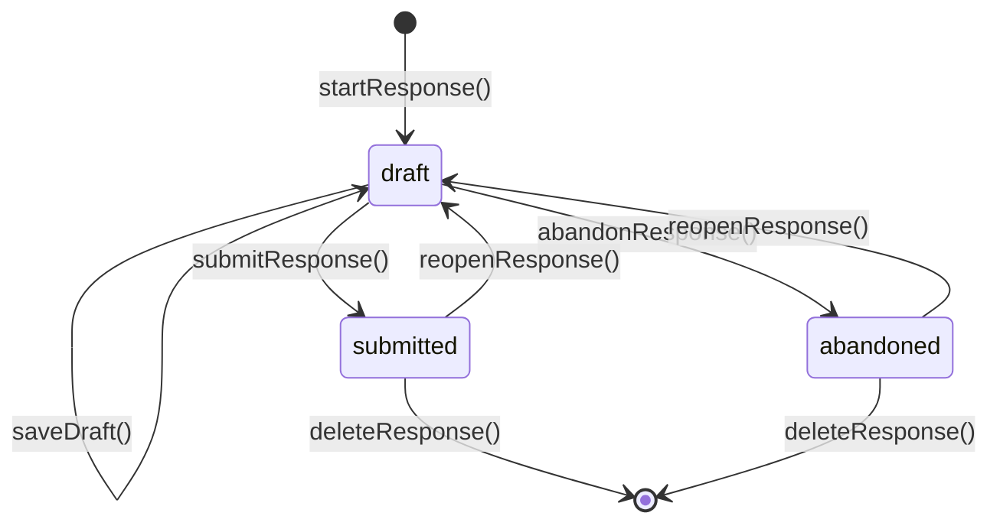

One of the foundational invariants of **dimah-form** is **Snapshot Immutability**: when a fill session begins, the system takes an exact deep snapshot of the form schema and stores it directly inside `response.definition`.

<Callout type="info">
  **The Snapshot Invariant**: All draft patching, conditional visibility
  calculations (`showWhen`), and final submission validations execute against
  **`response.definition`**, never against the live form schema.
</Callout>

---

## Why Snapshots Matter

In real-world applications, form schemas are constantly evolving. An administrator might:

- Add a new required field.
- Remove an existing field.
- Modify option values in a select dropdown.
- Change conditional visibility rules.

Without snapshots, an in-progress draft started on Monday would fail validation on Wednesday because the live form schema changed mid-fill.

With dimah-form:

1. Active responses stay **completely isolated** from live schema edits.
2. In-flight drafts can always be completed and submitted cleanly.
3. Historical submitted responses preserve the exact questions and options that the respondent saw when they filled the form.

---

## Response Statuses & State Machine

A response record transitions through three possible statuses:



| Status          | Meaning                                                           | Allowed API Actions                               |
| :-------------- | :---------------------------------------------------------------- | :------------------------------------------------ |
| **`draft`**     | In-progress fill session. Required fields can be empty.           | `saveDraft`, `submitResponse`, `abandonResponse`  |
| **`submitted`** | Finalized and locked. All visible required fields were validated. | `reopenResponse`, `deleteResponse`, `getResponse` |
| **`abandoned`** | Closed by user or admin without submitting. Locked from edits.    | `reopenResponse`, `deleteResponse`, `getResponse` |

---

## Lifecycle Methods

<Flow
  label="Response Lifecycle Stages"
  steps={[
    { name: "1. Start", kind: "protocol", note: "Freeze definition snapshot" },
    {
      name: "2. Draft",
      kind: "client",
      note: "Partial answer patches (null deletes)",
    },
    {
      name: "3. Submit",
      kind: "server",
      note: "Validate visible fields vs snapshot",
    },
    { name: "4. Reopen", kind: "data", note: "Unlock row back to draft" },
  ]}
/>

### 1. `startResponse`

- Resolves the target form by `id` or `slug`.
- Verifies that the form has `status: "active"`.
- Freezes the form definition into `response.definition`.
- Seeds any configured `defaultValue`s into `response.answers`.
- If called with `{ resume: true, respondentId: "user-123" }`, it checks for an existing unfinished draft and returns it instead of creating a duplicate.

### 2. `saveDraft`

- Accepts partial answer patches.
- Passing `null` as an answer value deletes that key from `answers`.
- **Does not require** visible required fields to be filled, enabling incremental progress across multi-page forms.
- Verifies that the record status is currently `draft`.

### 3. `submitResponse`

- Accepts final answer updates.
- Evaluates all conditional `showWhen` visibility rules against the current answers.
- Strips any hidden fields from the persisted answers so stale answers do not pollute your database.
- Validates that every **visible** field satisfies its validation rules and `required` constraints.
- Sets `status: "submitted"` and records `submittedAt: new Date().toISOString()`.

### 4. `abandonResponse`

- Sets `status: "abandoned"`.
- Locks the response row from further draft edits.

### 5. `reopenResponse`

- Moves a `submitted` or `abandoned` response back to `draft`.
- Preserves the original definition snapshot and answer values, allowing the respondent to edit and re-submit.

---

## Optimistic Concurrency Control (CAS)

When multiple tabs are open or when network connections reconnect, concurrent writes can accidentally overwrite newer answers.

dimah-form implements **Compare-And-Swap (CAS)** concurrency control using the `updatedAt` timestamp:

1. When the client loads or saves a draft, it receives the record's current `updatedAt` ISO timestamp.
2. Subsequent `saveDraft` or `submitResponse` requests include `updatedAt`.
3. The database adapter compares `expectedUpdatedAt` against the stored row:
   - If they match, the update commits and a new `updatedAt` timestamp is generated.
   - If they differ (because another tab or request wrote to the row first), the server rejects the request with a `409 STALE_UPDATE` error.
4. The `useFormResponse` hook automatically catches `STALE_UPDATE`, refreshes the latest server state, and notifies your UI.

---

## The Response Record Schema

Every response record in your database conforms to the following TypeScript structure:

```ts
type ResponseRecord = {
  /** Unique response identifier (e.g., CUID or UUID) */
  id: string;

  /** Foreign key to the parent form */
  formId: string;

  /** Current lifecycle status */
  status: "draft" | "submitted" | "abandoned";

  /** Frozen snapshot of the form definition at start time */
  definition: FormSnapshot;

  /** Key-value dictionary of respondent answers */
  answers: Record<string, unknown>;

  /** Optional user or session identifier */
  respondentId: string | null;

  /** Timestamp when the response was finalized */
  submittedAt: string | null;

  /** Record creation timestamp */
  createdAt: string;

  /** Last update timestamp (used for CAS optimistic locking) */
  updatedAt: string;
};
```

---

## Next Steps

<Cards>
  <Card
    title="Forms"
    href="/docs/forms"
    description="Learn how to structure form schemas, fields, and conditional showWhen rules."
  />
  <Card
    title="React Client"
    href="/docs/react"
    description="Wire useFormResponse to your UI components with automatic draft autosaving."
  />
  <Card
    title="Database"
    href="/docs/database"
    description="Required adapter: memory, optional FumaDB, or a custom store."
  />
</Cards>
