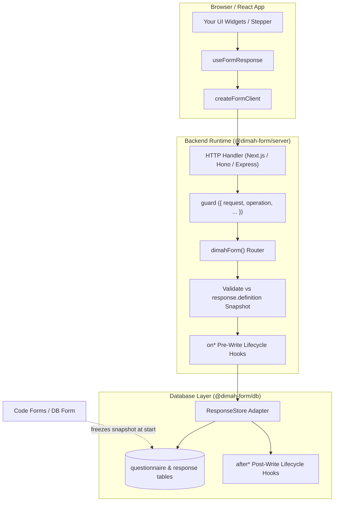

dimah-form is designed around a **headless, backend-first** architecture. The library manages the protocol, form definitions, snapshot freezing, draft tracking, and validation, while giving you 100% control over the user interface, authentication, and database layer.

---

## Architectural Principles

<Cards>
  <Card
    title="Headless by Design"
    description="Zero UI components, styles, or widget registries. You render fields using your existing design system."
  />
  <Card
    title="Snapshot Invariant"
    description="Fill sessions freeze the form schema at start time. In-flight drafts never break when forms are edited."
  />
  <Card
    title="Protocol Single Source of Truth"
    description="@dimah-form/core defines all routes, payloads, and validators. Server and client never drift."
  />
  <Card
    title="Zero-ORM Server Engine"
    description="@dimah-form/server has no database dependencies. Storage is abstracted through the ResponseStore interface."
  />
</Cards>

---

## System Flow

The diagram below illustrates how client interactions, HTTP routes, security guards, validation engines, and database stores interact:

<ArchitectureDiagram />

<Accordions>
<Accordion title="View Mermaid Diagram">

</Accordion>
</Accordions>

---

## Package Boundaries

Each package in the `dimah-form` monorepo has a strictly defined responsibility and dependency direction:

| Package                  | Environment | Responsibility                                                                                         | Key Exports                                                             |
| :----------------------- | :---------- | :----------------------------------------------------------------------------------------------------- | :---------------------------------------------------------------------- |
| **`@dimah-form/core`**   | Universal   | Protocol SSOT, Zod schemas, field definitions, answer validation, error codes, and type inference.     | `defineForm`, `defineFieldType`, `APIError`, `FORM_ERROR_CODES`         |
| **`@dimah-form/server`** | Server      | Backend router, HTTP framework adapters, `form.api`, lifecycle hook dispatcher, and `memoryAdapter()`. | `dimahForm()`, `toNextJsHandler`, `toHonoHandler`, `memoryAdapter`      |
| **`@dimah-form/react`**  | Browser     | Headless React client, session state machine, visibility resolver, field bindings, and autosave.       | `createFormClient()`, `useFormResponse()`, `fieldLabel`, `fieldOptions` |
| **`@dimah-form/db`**     | Server      | Production persistence adapter using FumaDB for Drizzle ORM and Prisma ORM.                            | `DimahFormDB`, `db()`                                                   |

---

## The 6-Stage Request Pipeline

Every incoming mutation or query follows a deterministic, 6-stage execution lifecycle:

<Flow
  label="Execution Lifecycle"
  steps={[
    { name: "1. Parse", kind: "protocol", note: "Zod query / body check" },
    { name: "2. Guard", kind: "server", note: "Auth & permissions" },
    { name: "3. Validate", kind: "protocol", note: "Against snapshot" },
    { name: "4. on* Hook", kind: "server", note: "Pre-write mutation" },
    { name: "5. Persist", kind: "data", note: "Store write & CAS" },
    { name: "6. after* Hook", kind: "server", note: "Side-effects" },
  ]}
/>

### 1. Inbound Parse & Schema Validation

The HTTP adapter parses the incoming HTTP request and validates query parameters or body payloads against the Zod schemas defined in `@dimah-form/core`. Malformed requests immediately return `400 VALIDATION_ERROR`.

### 2. Security Guard

The optional `guard` hook executes before any database or form logic. You inspect the `request`, `operation`, `formId`, or `responseId`, verify user session cookies/tokens, and enforce permissions. Throwing an `APIError` halts execution and sends a structured error response.

### 3. Snapshot Validation

When saving drafts or submitting responses, answer values are validated **against the frozen `response.definition` snapshot**, never against the live form schema. Submitting verifies that all visible required fields are populated and valid. Hidden fields (per `showWhen`) are automatically stripped.

### 4. Pre-Write Hooks (`on*`)

Pre-persistence hooks (such as `onStart`, `onDraft`, `onSubmit`) run before the database transaction. You can attach user identifiers (`response.respondentId = user.id`) or enrich metadata directly on the in-memory record.

### 5. Persistence & Optimistic Concurrency (CAS)

The `ResponseStore` writes the record to the database. If an `expectedUpdatedAt` timestamp was provided, the store verifies that the row has not been modified by another client in the meantime. If the timestamp differs, a `STALE_UPDATE` (409) conflict is raised.

### 6. Post-Write Hooks (`after*`)

After the database write successfully commits, post-persistence hooks (such as `afterSubmit`, `afterDraft`) trigger side-effects, such as sending confirmation emails, posting webhooks, or enqueuing background worker jobs.

---

## Next Steps

<Cards>
  <Card
    title="Snapshots & Lifecycle"
    href="/docs/snapshots"
    description="Learn how snapshots ensure schema immutability and handle draft lifecycles."
  />
  <Card
    title="Defining Forms"
    href="/docs/forms"
    description="Author schemas with defineForm, configure field types, and enable $Infer."
  />
  <Card
    title="React Client"
    href="/docs/react"
    description="Deep dive into useFormResponse, visible fields, and draft actions."
  />
  <Card
    title="Server Integration"
    href="/docs/server"
    description="Mount HTTP adapters across Next.js, Hono, Express, Fastify, and SvelteKit."
  />
</Cards>
