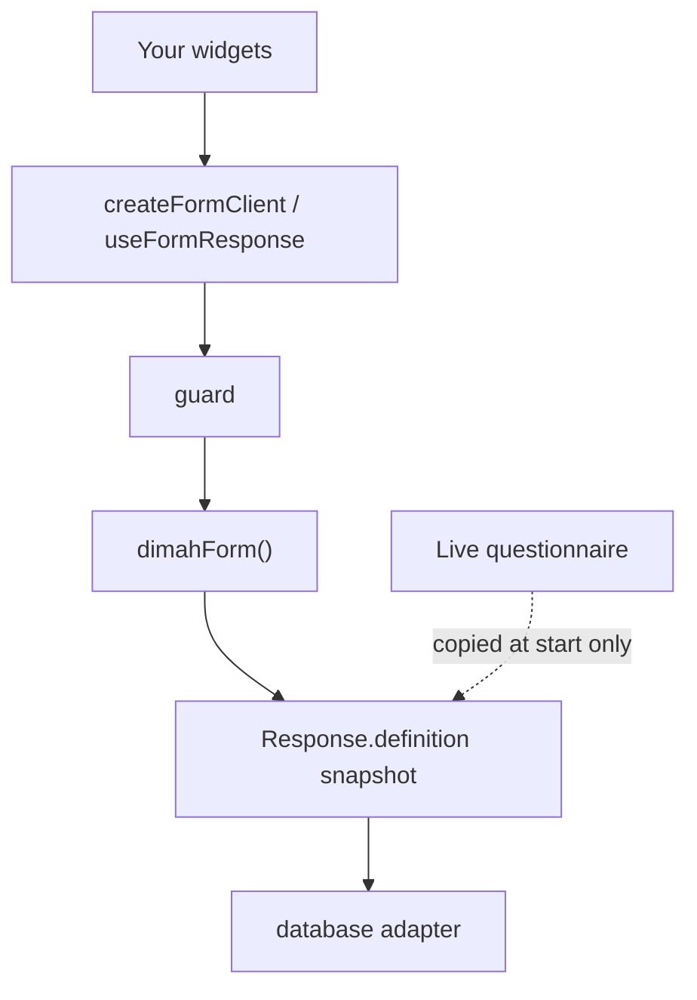

Backend-first questionnaire engine. You own widgets, auth, and the
database adapter. The library owns the protocol, definition snapshots,
and submit validation.

Start copies the live questionnaire onto the response. Draft and submit
validate that copy — not tonight's `saveForm`. There is no version table.
Lifecycle detail: [Snapshots](/docs/snapshots).

<ArchitectureDiagram />

<Accordions>
<Accordion title="Mermaid source for this diagram">



</Accordion>
</Accordions>

---

## Packages

```
@dimah-form/core          protocol, errors, createFormClient, fill session
        ↓
@dimah-form/server        dimahForm(), HTTP adapters, server plugins
@dimah-form/react         thin hooks around the same client
        ↑
@dimah-form/db            FumaDB adapter (peer of server)
```

| Package              | When to import it                                                                            |
| -------------------- | -------------------------------------------------------------------------------------------- |
| `@dimah-form/server` | Node / edge modules: `dimahForm`, `defineForm`, adapters                                     |
| `@dimah-form/react`  | Client components. The package is `"use client"`                                             |
| `@dimah-form/core`   | Shared `defineFieldType` modules used by **both** server and client; protocol/plugin authors |
| `@dimah-form/db`     | `DimahFormDB.client(…)` then `db(client)` as `database`                                      |

Apps do not pass the server instance into `createFormClient`. Copy `$Infer`
with `export type Form = typeof form` and `createFormClient<Form>()`.

Do not copy `FORM_API_ROUTES` or Zod payload schemas into `server` or
`react` — both import them from `core`. Browser client methods use object
args; `form.api` uses better-call `{ query }` / `{ body }`.

Config is instance-based:

```ts
dimahForm({
  database, // required
  forms, // optional code-authored catalog; feeds $Infer
  fieldTypes, // extra validators on this instance
  guard, // auth / policy — not a library feature
  hooks, // on* before persist, after* after persist
  plugins, // additive endpoints / hooks / field types / error codes
  metaSchema, // optional Zod for opaque meta bags
  validateAnswers, // extra issues after per-field validators
  basePath, // default /api/form
});
```

Plugins merge once in `dimahForm()`. They do not replace `database` and
must not add tables.

---

## Request pipeline

<Flow
  label="Every operation"
  steps={[
    { name: "parse", kind: "protocol", note: "query / body" },
    { name: "guard", kind: "server", note: "your policy" },
    { name: "on*", kind: "server", note: "after validate" },
    { name: "persist", kind: "data", note: "database" },
    { name: "after*", kind: "server", note: "side effects" },
  ]}
/>

1. Query/body parse. Zod failures throw `VALIDATION_ERROR`.
2. `guard({ request, operation, formId?, responseId?, getResponse, getForm })`. Throw `APIError`
   to reject. A plain `Error` becomes `INTERNAL_ERROR`. `getResponse` / `getForm`
   read the store (and code catalog) without HTTP or guard re-entry.
3. Handler logic. For submit, `parseAnswers` runs against
   **`existing.definition`**, not `config.forms`.
4. `on*` hooks (may mutate the row, e.g. `respondentId` on start).
5. Persist. If this throws, `after*` is skipped.
6. `after*` hooks — mail, queues, webhooks.

Plugin `on*` / `after*` run first (`dependsOn`, then registration order),
then instance hooks.

---

## Headless fill

`useFormResponse` (React) and `createFormResponseSession` (core) are the
fill loop: visibility, local validation, draft, submit, reopen, abandon.
They expose `visibleFields` and `field(id)` — a binding, not a widget.

---

## See also

<Cards>
  <Card
    title="Snapshots"
    href="/docs/snapshots"
    description="Response lifecycle, concurrency, record shape."
  />
  <Card
    title="Server"
    href="/docs/server"
    description="Mount the handler and call form.api."
  />
  <Card
    title="Configuration"
    href="/docs/configuration"
    description="dimahForm, client, and ResponseStore options."
  />
</Cards>
