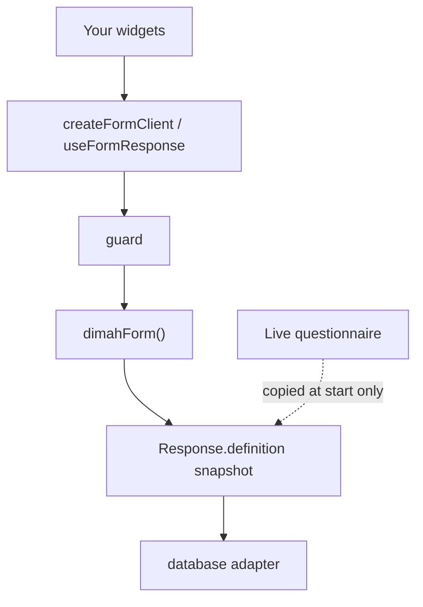

dimah-form is a **protocol and validation engine**. Your app supplies widgets, auth, and persistence. The instance (`dimahForm()`) is the registry for field types, hooks, plugins, and the HTTP handler.

<Callout>
  People usually get two things wrong: they look for a form renderer, and they
  expect submit to validate against the **live** questionnaire. Neither is true.
  You render. Submit uses the **snapshot** on that response.
</Callout>

<ArchitectureDiagram />

<Accordions>
<Accordion title="Mermaid source for this diagram">



</Accordion>
</Accordions>

## What each side owns

| Library                                                 | You                                                               |
| ------------------------------------------------------- | ----------------------------------------------------------------- |
| Route strings and payload schemas in `@dimah-form/core` | Field widgets and layout                                          |
| Snapshot copy at `startResponse`                        | `guard` (auth / tenancy / staff-only)                             |
| Draft patch + submit replace + validation               | `database` choice (`memoryAdapter`, `db()`, or a `ResponseStore`) |
| Stable error `code` + English `message`                 | Localizing from `code` in the UI                                  |
| `defineFieldType` validators and `$Infer`               | Mapping `field.type` to a component                               |

Do not copy `FORM_API_ROUTES` or Zod payload schemas into `server` or `react` — both packages import them from `core`. Browser client methods use object args; `form.api` uses better-call `{ query }` / `{ body }`. Same paths, different call shape.

## Packages

```
@dimah-form/core          protocol, errors, createFormClient, fill session
        ↓
@dimah-form/server        dimahForm(), HTTP adapters, server plugins
@dimah-form/react         thin hooks around the same client
        ↑
@dimah-form/db            FumaDB adapter (peer of server)
```

| Package              | When to import it                                                                            |
| -------------------- | -------------------------------------------------------------------------------------------- |
| `@dimah-form/server` | Node / edge modules: `dimahForm`, `defineForm`, adapters                                     |
| `@dimah-form/react`  | Client components. The package is `"use client"`                                             |
| `@dimah-form/core`   | Shared `defineFieldType` modules used by **both** server and client; protocol/plugin authors |
| `@dimah-form/db`     | `DimahFormDB.client(…)` then `db(client)` as `database`                                      |

Apps do not pass the server instance into `createFormClient`. Copy `$Infer` with `export type Form = typeof form` and `createFormClient<Form>()`.

Config is instance-based:

```ts
dimahForm({
  database, // required
  forms, // optional code-authored catalog; feeds $Infer
  fieldTypes, // extra validators on this instance
  guard, // auth / policy — not a library feature
  hooks, // on* before persist, after* after persist
  plugins, // additive endpoints / hooks / field types / error codes
  metaSchema, // optional Zod for opaque meta bags
  basePath, // default /api/form
});
```

Plugins merge once in `dimahForm()`. They do not replace `database` and must not add tables.

## Request pipeline

<Flow
  label="Every operation"
  steps={[
    { name: "parse", kind: "protocol", note: "query / body" },
    { name: "guard", kind: "server", note: "your policy" },
    { name: "on*", kind: "server", note: "after validate" },
    { name: "persist", kind: "data", note: "database" },
    { name: "after*", kind: "server", note: "side effects" },
  ]}
/>

1. Query/body parse. Zod failures throw `VALIDATION_ERROR`.
2. `guard({ request, operation, formId?, responseId? })`. Throw `APIError` to reject. A plain `Error` becomes `INTERNAL_ERROR`.
3. Handler logic. For submit, `parseAnswers` runs against **`existing.definition`**, not `config.forms`.
4. `on*` hooks (may mutate the row, e.g. `respondentId` on start).
5. Persist. If this throws, `after*` is skipped.
6. `after*` hooks — mail, queues, webhooks.

Plugin `on*` / `after*` run first (`dependsOn`, then registration order), then instance hooks.

## Headless fill

`useFormResponse` (React) and `createFormResponseSession` (core) are the fill loop: visibility, local validation, draft, submit, reopen, abandon. They expose `visibleFields` and `field(id)` — a binding, not a widget. A later UI package should wrap `FormFieldBinding` / `FormResponseApi`, not fork this loop.

## See also

<Cards>
  <Card
    title="Snapshots"
    href="/docs/concepts/snapshots"
    description="Why the response stores a definition copy, and the lifecycle."
  />
  <Card
    title="Server"
    href="/docs/guides/server"
    description="Mount the handler and call form.api."
  />
  <Card
    title="Configuration"
    href="/docs/reference/configuration"
    description="dimahForm, client, and ResponseStore options."
  />
</Cards>
